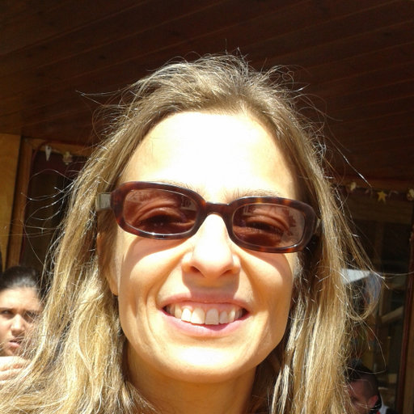

<html>
<head>
<meta name="viewport" content="width=device-width, initial-scale=1">

</head>
<body>

    
 
        <h1>Current supervisors</h1>
        

            
            
        

    

    

        <h1>Past supervisors</h1>
        

            
            
        

    

    <h1>Co-authors</h1>

        
        
        
        

